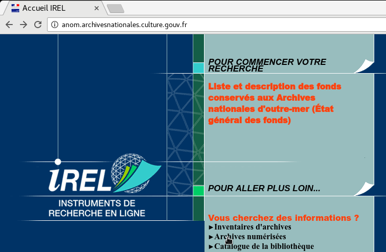
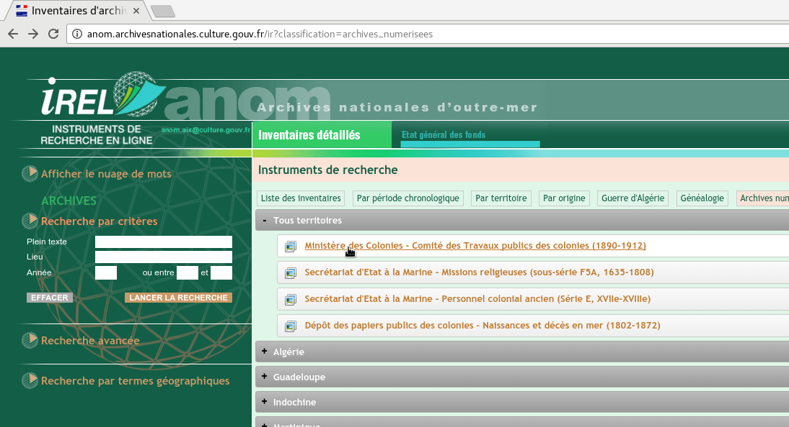
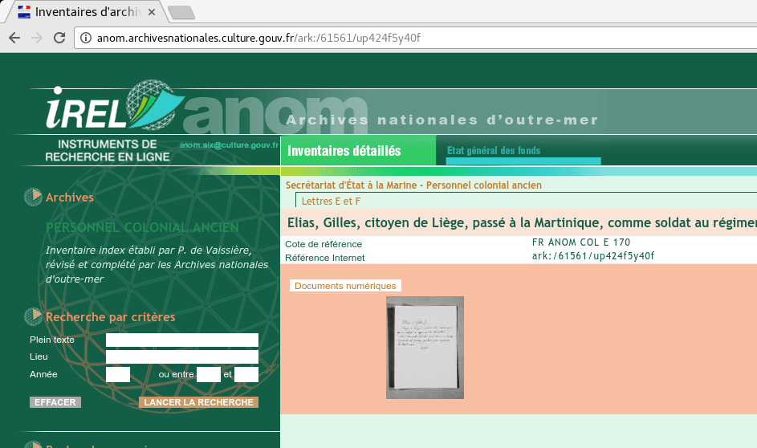
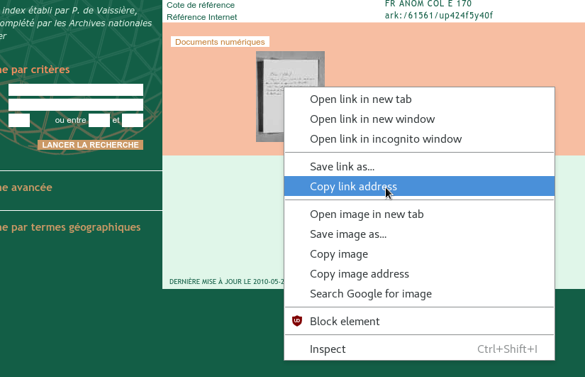
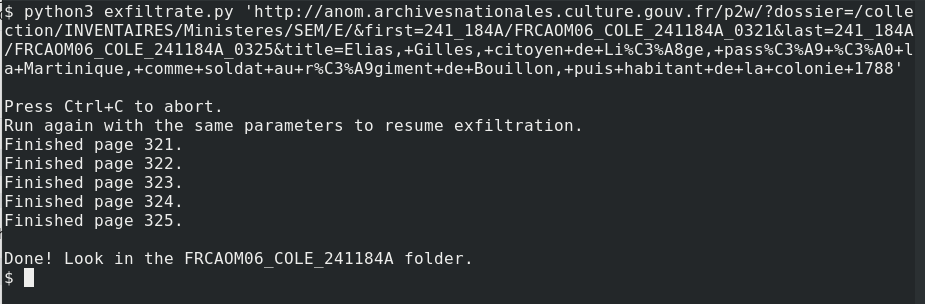
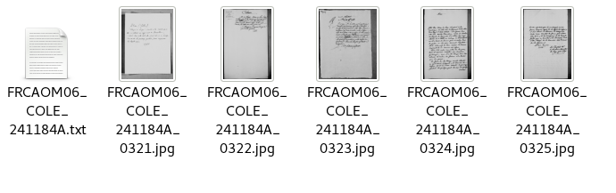

# Archives Nationales d'Outre-Mer Digital Archive Exfiltrator
Exfiltrate full document images from the Archives Nationales d'Outre-Mer digital archive instead of being forced to use their Java applet.

## Motivation
ANOM gives access to digital copies of archive materials only through a lol-welcome-to-the-90s Java applet. The documents themselves are served up as small fragments of pages which are then stitched together on the screen, just like a tile server for a [tiled web map](https://en.wikipedia.org/wiki/Tiled_web_map). 

\<rant\>

As far as I can tell, there's no good reason for them to do that. If they're saving anything at all on bandwidth, which I kinda doubt, they're losing it on some janky-ass 90s arcane storage infrastructure. There are only 3 image zoom levels judging by the applet's GET requests observed by Wireshark, and the use case for these documents is as far away from diving into google maps as you can get. Researchers would be far better served by having thumbnail, medium, and full size whole images available without hoops. Hell, it's doable without even changing the tech just by treating each layer as one big tile.

\</rant\>

Anyway, they way they do it now makes their digital archive documents rather difficult to use.
The first step to making them easier to use is getting them out.

## Dependencies
* Python3 - https://www.python.org/downloads/
* GraphicsMagick - http://www.graphicsmagick.org/README.html

## Usage
`python3 exfiltrate.py '<document_applet_url>' [first_page] [last_page]`

### Walkthrough...
1. go to http://anom.archivesnationales.culture.gouv.fr/

2. Click on the digital archive link

3. Go find whatever document you're looking for.

4. Instead of clicking on the document link to load their stupid Java applet, right-click and copy the link address.

5. In a terminal with python3 installed, paste the copied link address where the above usage note says \<document_applet_url\> as shown.

6. The result is a folder containing complete images of the document pages, plus a text file containing the full title.

